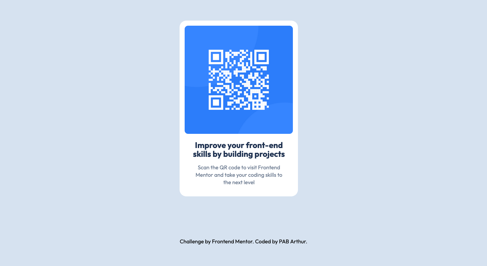

# Frontend Mentor - QR code component solution

This is a solution to the [QR code component challenge on Frontend Mentor](https://www.frontendmentor.io/challenges/qr-code-component-iux_sIO_H). Frontend Mentor challenges help you improve your coding skills by building realistic projects.

## Table of contents

- [Overview](#overview)
  - [Screenshot](#screenshot)
  - [Link](#link)
- [My process](#my-process)
  - [Built with](#built-with)
  - [Continued development](#continued-development)
  - [Useful resource](#useful-resource)
- [Author](#author)
- [Acknowledgment](#acknowledgment)

## Overview

### Screenshot

### Link

- Live Site URL: [warm-queijadas-eb6e08](https://warm-queijadas-eb6e08.netlify.app/)

## My process

### Built with

- Semantic HTML5 markup
- CSS Grid

### Continued development

One of the key areas I want to continue focusing on in future projects is media queries. While I've made significant progress in creating responsive designs, I aim to further refine and perfect my understanding and implementation of media queries.

### Useful resource

- [A (more) Modern CSS Reset](https://piccalil.li/blog/a-more-modern-css-reset/) - This helped me reset the default styling for better consistency across browsers. I really liked this pattern and will use it going forward.

## Author

- Frontend Mentor - [@pabjunior](https://www.frontendmentor.io/profile/pabjunior)
- Twitter - [@pabjunior](https://x.com/PAB_junior)

## Acknowledgments

I would like to express my gratitude to the Frontend Team for their invaluable contributions to this project. Their expertise, creativity, and dedication have been instrumental in bringing this project to life.
